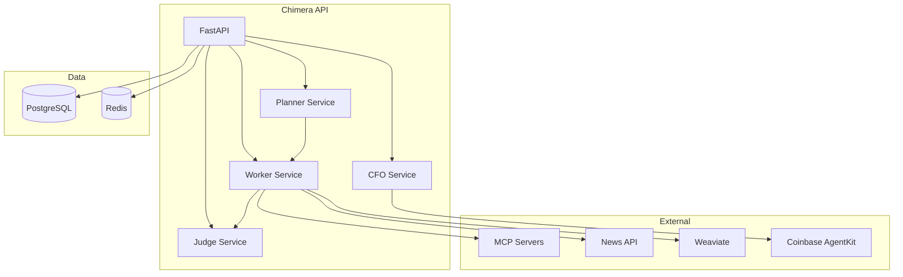
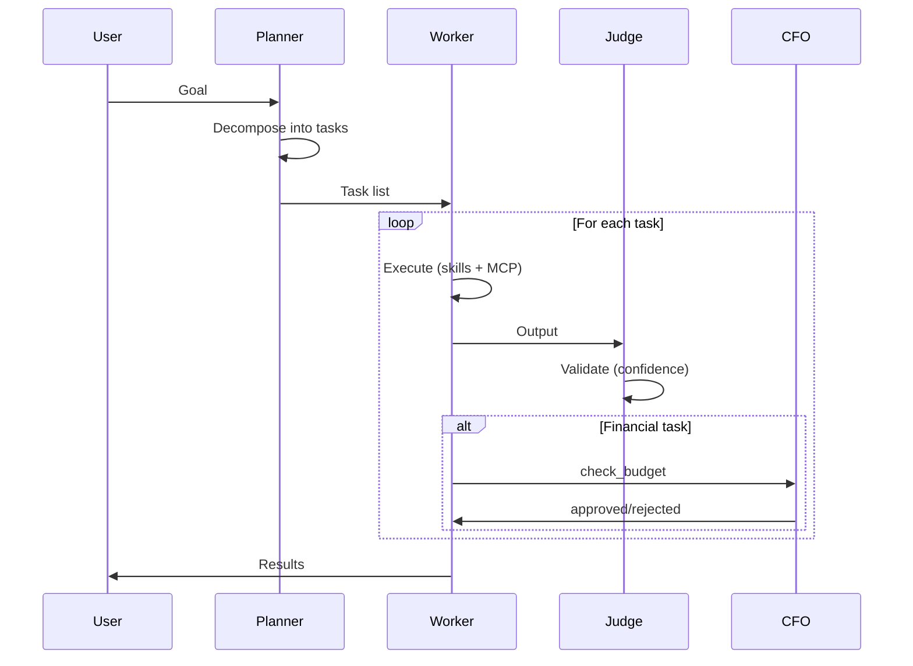

# Architecture Strategy — Project Chimera

## High-Level Architecture

## Planner–Worker–Judge (FastRender Swarm)

## Data Flow

| Layer        | Responsibility                          |
|-------------|------------------------------------------|
| **API**     | FastAPI routers, health, metrics         |
| **Services**| Planner, Worker, Judge, CFO (business logic) |
| **Skills**  | fetch_trends, generate_content, execute_transaction |
| **MCP**     | All external calls (no direct APIs)      |
| **Data**    | PostgreSQL (ops), Weaviate (memory), Redis (cache) |

## Decisions

- **MCP-only external calls**: Ensures platform-agnostic publishing and testability.
- **CFO Judge**: All financial flows pass budget and anomaly checks before execution.
- **Skills vs MCP**: Skills are Python modules; MCP exposes tools/resources. Skills use MCP.
