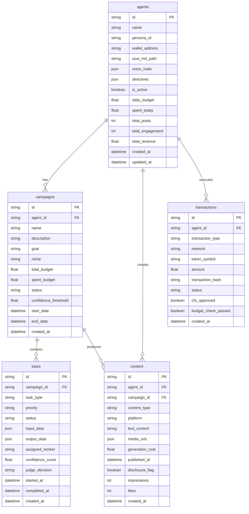

# Database ERD — Project Chimera

Executable specification: Entity-Relationship view of PostgreSQL and linked stores.  
**Referred from:** [technical.md](technical.md#databaseschemas)

## PostgreSQL (Operational Data)

## Store Purposes (Reference)

| Store      | Purpose |
|-----------|---------|
| PostgreSQL | Agents, campaigns, tasks, content, transactions (above ERD) |
| Weaviate  | Agent memories, persona definitions, world knowledge |
| Redis     | Episodic cache, task queues |
| OnChain   | Immutable financial transaction ledger |
